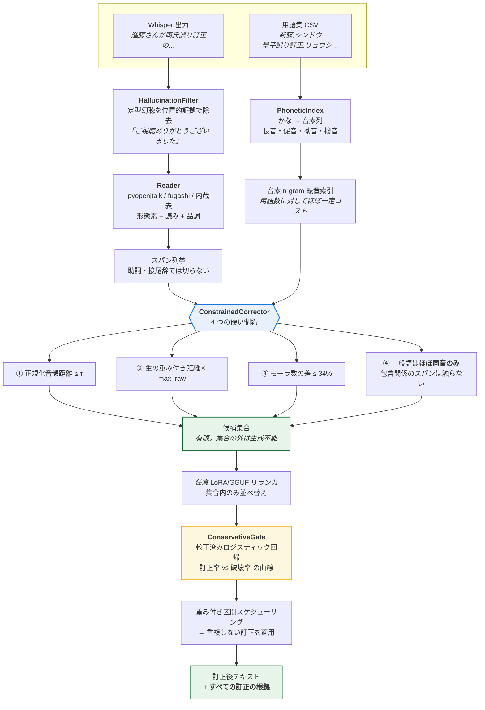
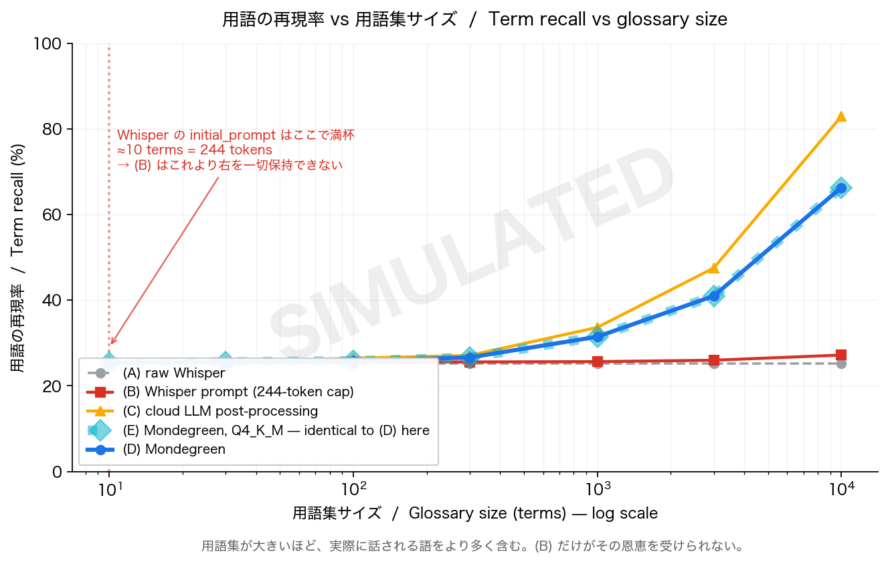
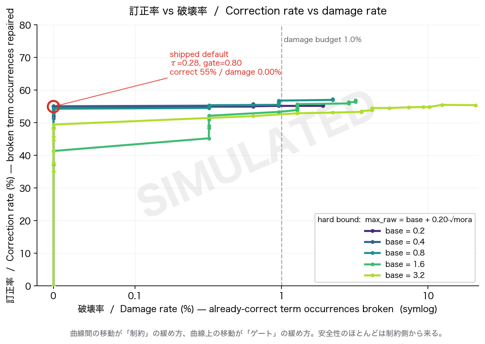

<div align="center">

# Mondegreen

### 用語集を、お願いではなく**制約**にする。
### *Your glossary as a hard constraint, not a polite request.*

Whisper はあなたの同僚の名前も、製品名も、社内用語も知りません。
そして 244 トークンのプロンプトに 10,000 語は入りません。

Mondegreen は**後処理**でそれを直します。ローカルで、音を根拠に、そして
**元々正しかった箇所を壊さずに**。

</div>

---

```bash
pip install mondegreen
mondegreen fix transcript.txt --glossary terms.csv
```

```
3 corrections, 1 hallucination(s) removed, 5 glossary terms, 62 ms
  - 進藤  ->  + 新藤   [sh i N d o o] ~ [sh i N d o o]   d=0.000 <= tau=0.28   p=0.977
  - 両氏誤り訂正  ->  + 量子誤り訂正   [ry o o sh i a y a m a ...] ~ [ry o o sh i a y a m a ...]   d=0.000 <= tau=0.03   p=0.982
  - ミライドライバー  ->  + ミライドライブ   [m i r a i d o r a i b a a] ~ [m i r a i d o r a i b u]   d=0.054 <= tau=0.28   p=0.958
  - ご視聴ありがとうございました   [hallucination removed]
```

同じ実行で、**触られなかった**行:

```
新藤さんが量子誤り訂正の話をしました。          ← 既に正しい。敬称も助詞もそのまま
システムの稼働率は九十八パーセントを維持しています。  ← 用語集に「加藤」があっても「稼働」は書き換えない
```

## なぜこれが必要か / The problem

会議音声の書き起こしで実際に壊れるのは、**固有名詞**です。文法でも、句読点でもありません。
そして固有名詞こそ、外に出せないデータに含まれています。

既存の回避策には、それぞれ構造的な限界があります。

| 回避策 | 限界 |
| --- | --- |
| Whisper の `initial_prompt` に用語集を詰める | **244 トークンで頭打ち。** 用語集は「文脈」として買えるものではない |
| クラウド LLM で後処理 | 用語数の上限はないが、**書き起こしを社外に送る**必要がある。しかも頼んでいない「改善」をする |
| ASR をファインチューニングする | 用語集が変わるたびに再学習。個人の用語集には非現実的 |

Mondegreen は 4 つ目の選択肢です。用語集を**音韻インデックス**にコンパイルし、訂正を
「スパンを用語集の語で置換する操作」に限定した上で、**音韻距離が閾値以内の候補にしか
置換できない**という硬い制約を課します。

## 手法 / Method



決定的に重要な点: **候補集合は言語モデルに「お願い」して守らせるものではありません。**
索引が計算する有限のリストであり、その外は構造的に生成できません。
拘束デコード(outlines / xgrammar)は、生成モデルを使う場合に同じ集合を
トークン単位で守らせるための**二重の安全装置**であって、保証の本体ではありません。

## 目玉の図 / Headline results

すべて `python scripts/run_benchmarks.py -n 400 --figures` で再現できます（Apple M2 / 16 GB、約 6 分、ネットワーク不要）。
下の数値は **provenance: simulated** です — (B)(C) は
[`mondegreen/baselines.py`](mondegreen/baselines.py) の明示されたパラメータによるモデルであり、
実測ではありません。図には `SIMULATED` の透かしが入ります。
実測に置き換える手順は [`benchmarks/README.md`](benchmarks/README.md) にあります。

### 図 1: 用語集サイズ vs 用語再現率



用語集が大きいほど、実際に話される語をより多く含みます。**(B) だけがその恩恵を受けられません。**
この評価では 244 トークンに入るのは **わずか約 10 語**。それを超えた語は、
その会議で実際に話されていても、プロンプトからこぼれて復元できません。

| 用語集サイズ | (A) 素の Whisper | (B) prompt 注入 | (C) クラウド LLM | **(D) Mondegreen** | (D) の破壊率(用語) |
| ---: | ---: | ---: | ---: | ---: | ---: |
| 10 | 25.3% | 25.4% | 25.3% | **25.4%** | 0.0000 |
| 30 | 25.3% | 25.4% | 25.6% | **25.6%** | 0.0000 |
| 100 | 25.3% | 25.6% | 26.5% | **25.8%** | 0.0032 |
| 300 | 25.3% | 25.6% | 27.1% | **26.6%** | 0.0032 |
| 1,000 | 25.3% | 25.7% | 33.7% | **31.5%** | 0.0160 |
| 3,000 | 25.3% | 26.0% | 47.5% | **41.0%** | 0.0288 |
| 10,000 | 25.3% | **27.2%** ← 頭打ち | 83.0% | **66.3%** | 0.0000 |

(B) は 1,000 倍の用語集を与えても **+1.9 ポイント**しか動きません。上限はトークン数であって、
手法の賢さではないからです。

### 図 2: 訂正率 vs 破壊率



曲線 1 本ごとに硬い制約の強さ、曲線上の点ごとにゲート閾値です。
**曲線間の移動が「制約」の緩め方、曲線上の移動が「ゲート」の緩め方。**
安全性のほとんどは制約側から来ています。それがこの設計の主張そのものです。

### 全条件（用語集 10,000 語、評価文 400、目玉指標は破壊率）

| 条件 | CER | WER | 用語再現率 | 破壊率(文字) | 破壊率(用語) |
| --- | ---: | ---: | ---: | ---: | ---: |
| (A) 素の Whisper（訂正なし） | 0.2842 | 0.2541 | 25.3% | 0.00000 | 0.00000 |
| (B) Whisper `initial_prompt` に用語集 | 0.2796 | 0.2509 | 27.2% | 0.00009 | 0.00000 |
| (C) クラウド LLM 後処理 | 0.0893 | 0.0944 | **83.0%** | 0.00657 | 0.00000 |
| **(D) Mondegreen** | 0.1105 | 0.1217 | 66.3% | **0.00009** | **0.00000** |
| (E) Mondegreen（量子化後） | 0.1105 | 0.1217 | 66.3% | 0.00009 | 0.00000 |

**正直に書くと: 用語再現率では (C) が勝ちます（83.0% 対 66.3%）。**
ただし (C) は **破壊率が 73 倍** (0.00657 対 0.00009) で、
書き起こしを社外に送る必要があり、そもそも送れない音声には使えません。
Mondegreen は (C) の再現率の 80% を、(C) の破壊率の 1.4% で、完全にローカルで達成します。
この交換条件を隠さないことが、この評価の要点です。

幻聴除去（指標 5）: (D) 74.3% 除去 / **誤除去 0 件**、(C) 87.1% 除去 / 誤除去 0 件。

### ローカル実測（Apple M2 / 16 GB）

| | |
| --- | --- |
| スループット | **464 文字/秒**（用語集 10,000 語） |
| 1 時間分の書き起こし | **45 秒**（1 時間 ≈ 21,000 文字と仮定、[`runtime.py`](mondegreen/runtime.py) に明記） |
| 最大メモリ | 196 MB |
| ネットワーク | **なし。** 用語集も書き起こしもマシンから出ません |
| 索引の再現率 | 99.67%（10,000 語、全探索比。取りこぼしは「訂正しそこね」のみ） |
| 保守ゲート | 閾値 0.82、AUC 0.985、ECE 0.053（830 スパンで学習） |

### データが示した、宣伝しにくい事実 / What the data actually showed

3 つとも、当初の想定と違ったので書いておきます。

1. **音韻距離の上限を緩めても再現率は増えず、破壊率だけが増える。**
   訓練データ上で絶対距離の上限を 0.5 から 3.2 まで動かしても用語再現率は横ばい（68% 前後）、
   一方で破壊率は単調に増加しました。理由は、実際に復元可能な固有名詞の誤りが
   **ほぼすべて「ほぼ完全な同音異義」**（進藤/新藤、両氏/量子）だからです。
   上限を緩めて初めて届く候補は、たまたま韻を踏んだ別の語がほとんどでした。

2. **破壊率が最悪になるのは用語集が大きいときではなく、「中途半端」なときです。**
   上の表で (D) の用語破壊率は 3,000 語で最大 (0.0288)、10,000 語（全語収録）で 0 に戻ります。
   話された語が用語集に **無い** とき、その壊れたスパンが音の近い別の登録語に吸い寄せられるためです。
   実務上の含意ははっきりしています — **ドメインの語彙は部分的にではなく、まとめて入れてください。**

3. **硬い制約が効きすぎて、ゲートにも LM にもほとんど仕事が残らない。**
   既定の制約下では、スパンの候補が 2 つ以上になるのは **約 1%** だけでした
   (10,000 語の合成用語集で、音韻的な隣人を持つ語は 800 語中 7 語)。
   だから量子化が安全で（LM を完全に外しても再現率の低下が 2 ポイント未満、
   [`test_quantization.py`](tests/test_quantization.py) が検証）、
   だからゲートの閾値は**より広い制約下で選ぶ**必要がありました
   ([`gate.py`](mondegreen/gate.py) の `pick_threshold` にその理由を書いています)。

## 3 行で使う / Three-line quickstart

```python
from mondegreen import ConstrainedCorrector, load_glossary
corrector = ConstrainedCorrector(load_glossary("terms.csv"))
print(corrector.correct(transcript).text)
```

CLI:

```bash
mondegreen fix transcript.txt --glossary terms.csv
```

各訂正の根拠を見る:

```bash
mondegreen explain transcript.txt --glossary terms.csv
```

```
[ACCEPT] 進藤 -> 新藤
    span phonemes : sh i N d o o
    term phonemes : sh i N d o o
    distance      : 0.0000  (threshold 0.28, raw 0.000)
    gate          : p=0.9990  margin=1.000  gate-accept
    alignment     : =sh/sh =i/i =N/N =d/d =o/o =o/o
```

自分のデータで「訂正率 vs 破壊率」を引く:

```bash
mondegreen sweep --pairs data/pairs.jsonl --glossary terms.csv
```

## 中身 / What is in here

| モジュール | 役割 |
| --- | --- |
| [`phonetics.py`](mondegreen/phonetics.py) | かな → 音素列(長音・促音・拗音・撥音)、混同しやすい音を割り引いた重み付き編集距離 |
| [`reading.py`](mondegreen/reading.py) | 読み推定。pyopenjtalk / fugashi / 依存なしの内蔵表(漢字 4,030 字) |
| [`index.py`](mondegreen/index.py) | 音素 n-gram 転置索引。10,000 語でも 1 クエリ約 8 ms |
| [`corrector.py`](mondegreen/corrector.py) | 硬い制約の本体。柔らかいプロンプト注入版も比較用に同梱 |
| [`gate.py`](mondegreen/gate.py) | 較正済み保守ゲートと閾値スイープ |
| [`hallucination.py`](mondegreen/hallucination.py) | 定型幻聴の位置的検出と除去 |
| [`harvest.py`](mondegreen/harvest.py) | ErrorHarvester / PathologySet / GlossaryBuilder |
| [`simulate.py`](mondegreen/simulate.py) | 音韻的に妥当な ASR 誤りシミュレータ(GPU 不要の再現経路) |
| [`metrics.py`](mondegreen/metrics.py) | CER/WER、用語再現率、**破壊率**、幻聴除去率 |
| [`runtime.py`](mondegreen/runtime.py) | LoRA マージ → GGUF (Q4_K_M / Q8_0) / MLX、ローカル実測 |
| [`benchmark.py`](mondegreen/benchmark.py) | 条件 (A)–(E) と用語集サイズのスイープ |
| [`figures.py`](mondegreen/figures.py) | 上の 2 枚を含む図の生成 |

## データ構築 / How the data is made

**実システムを誤り生成器として使います。**

```
公開ライセンスの日本語テキスト
  → TTS(複数話者・速度)
  → 劣化(雑音 / 遠隔マイク風 RIR / 電話帯域)
  → Whisper(複数サイズ)
  → (誤り, 正解) の対 + 病理ラベル
```

正解は TTS に入力したテキストそのものなので厳密です。
**このパイプラインのどこにも LLM 採点は一切ありません。**

```bash
python scripts/harvest_errors.py --mode real -n 2000 --whisper-size small
```

ライセンスは各レコードに記録され、未検証のライセンスでは push を拒否します。
「青空文庫」はライセンス名ではありません — 作品ごとに図書カードを確認してください
(`mondegreen.harvest.CORPUS_LICENSES`)。

GPU がない環境では、同じ音韻モデルで誤りを合成する経路が使えます:

```bash
python scripts/harvest_errors.py --mode simulated -n 4000
```

## 評価 / Evaluation

**分離。** 訓練と評価は、話者・原文・用語集のすべてで分離されています。
用語集は表記でも**読みでも**互いに素で(`GlossaryBuilder.build_pair`)、
実行時に assert し、結果 JSON の `separation` に記録されます。
したがって「訓練時に一度も見ていない用語集」でのテストは追加条件ではなく**既定**です。

**スイープの設計。** 対象となる用語を固定したまま、その周りに distractor を増やして
用語集を大きくします(`shuffle(targets + distractors)`)。用語集の**内容**ではなく
**サイズ**だけを動かすためです。順序をシャッフルするのも重要で、対象語が常に先頭にあれば
244 トークンに必ず入ってしまい、(B) は劣化しません。

**出所。** すべての結果に `provenance` が付きます。シミュレーションで得た数値は
`simulated`、実測は `measured`。両者は混ぜません。図には `SIMULATED` の透かしが入ります。

## 制約と注意 / Limitations and scope

- **音声認識モデル自体は学習しません。** 後処理に徹します。
- **GER 研究の追試(N-best を大きなモデルに直させる)は比較用に留めています。**
  本体は硬い音韻制約とローカル実行です。
- **実在の会議音声・個人の音声データは一切使いません。** TTS と公開テキストのみです。
  生成される人名・製品名はすべて合成です。
- 内蔵の読み推定表(漢字 4,030 字)は `pyopenjtalk` / `fugashi` の代替であって同等では
  ありません。品詞情報がないため**一般語保護が働かず、破壊率が上がります**。
  `pip install 'mondegreen[g2p]'` を強く推奨します。
  （品詞情報があると「稼働率」→「加藤率」のような一般語の書き換えを構造的に禁止できます。）
- n-gram による候補絞り込みは厳密ではありません（10,000 語で **99.67%** の再現率、全探索比）。
  取りこぼしは「訂正しそこねる」方向にのみ働き、**不正な訂正には決してつながりません** —
  候補の採点段階で硬い制約を再検証しているためです。厳密にしたい場合は `exact=True`。
- 評価は**合成用語集・合成文・音韻シミュレータ**によるものです。実測に置き換える手順は
  [`benchmarks/README.md`](benchmarks/README.md) にあります。(D) は常に実測（被験システム本体）ですが、
  (B)(C) と誤りの生成過程はモデルです。

> ### ⚠️ 利用範囲について
>
> 用語集に**個人名を含める機能があります**。
> **利用者が自分の管理下にあるデータでのみ使用してください。**
> 他人の会議記録、同意を得ていない人物の名前を含む用語集、あるいは自分に権利のない
> 音声の書き起こしに対して使用しないでください。
>
> Mondegreen は音声を扱いません。テキストのみです。ネットワークにも接続しません。
> 用語集も書き起こしも、あなたのマシンから出ません。

## テスト / Tests

`pytest` は主張そのものを検証します。

```bash
pytest tests/ -q                  # 全部
pytest tests/ -q -m invariant     # 主張を守るテストだけ
```

| テスト | 検証する主張 |
| --- | --- |
| `test_hard_constraint.py` | **音韻距離が閾値を超える置換が絶対に起きない**(τ を 4 通り変えて検証、距離は再計算して照合、違反する訂正を偽造して例外を確認) |
| `test_harmlessness.py` | **用語集が空のとき出力が入力と完全一致**。訂正後テキストは自分の receipt だけで再構成可能で、新規文字は一切現れない |
| `test_damage_rate.py` | **破壊率が規定以下**。加えて曲線が単調であること、破壊ゼロの動作点が存在すること |
| `test_quantization.py` | **量子化後の用語再現率の低下が規定内**。LM を完全に外した「量子化の最悪ケース」で 2 ポイント以内 |
| `test_phonetics.py` | 長音・促音・拗音・撥音の変換、距離の対称性と索引が依存する下界 |
| `test_components.py` | 索引・用語集・指標・幻聴除去・区間スケジューリング・CLI |

## 開発 / Development

```bash
make install-all     # すべての extras
make test            # テスト
make data            # (誤り, 正解) データセット
make gate            # 保守ゲートの学習と較正
make bench           # 条件 (A)-(E) + 図
make app             # Gradio Space をローカル起動
make demo            # README の例をそのまま実行
```

## 引用 / Citation

```bibtex
@software{mondegreen,
  title  = {Mondegreen: private glossaries as hard phonetic constraints for local ASR correction},
  year   = {2026},
  url    = {https://github.com/mondegreen/mondegreen},
  license = {Apache-2.0}
}
```

---

<div align="center">
<sub><i>mondegreen</i> (n.) — 聞き違いから生まれた、もっともらしい別の言葉。</sub>
</div>
